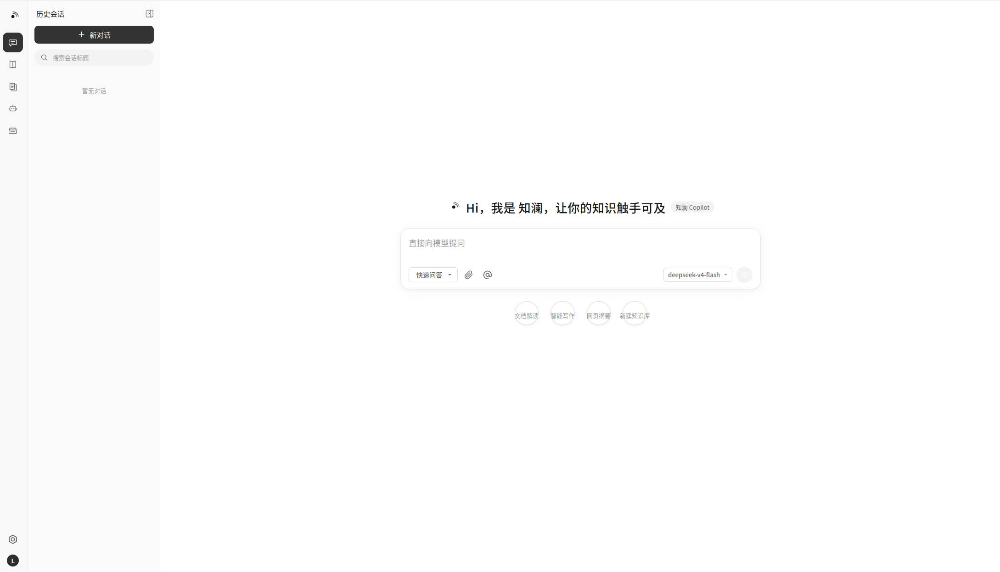
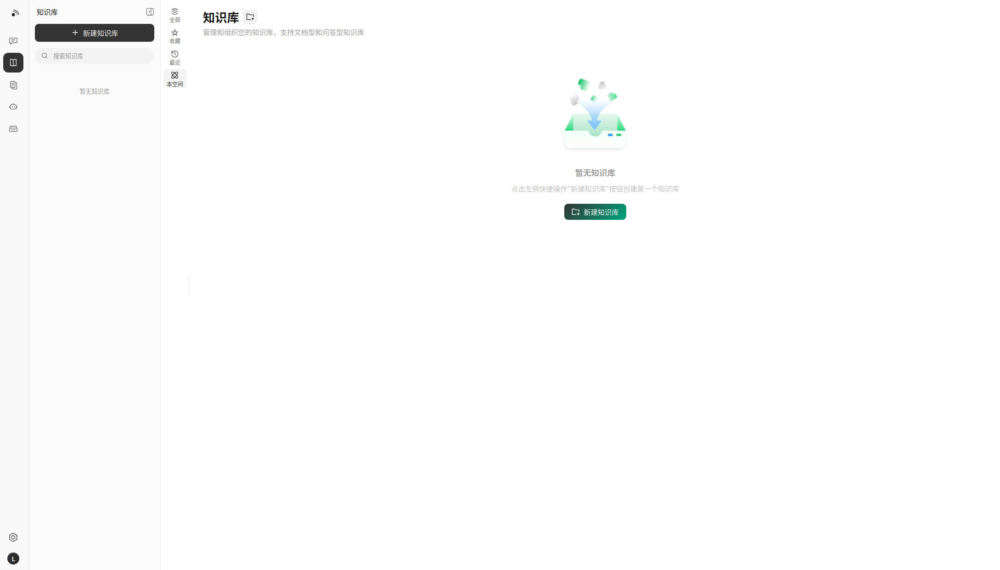
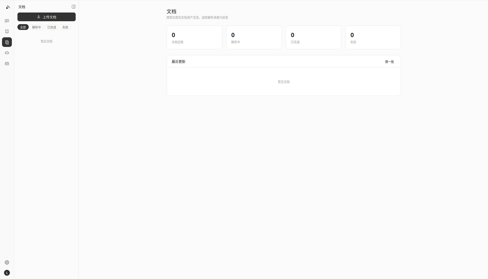
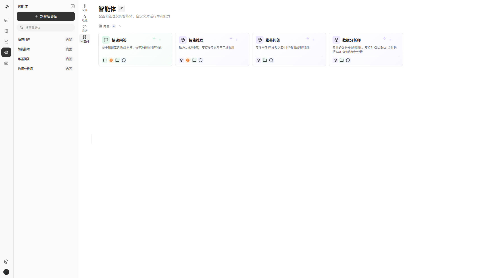
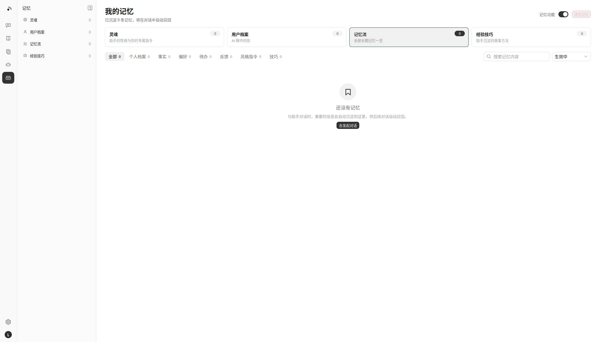

<div align="center">

<picture>
  <source media="(prefers-color-scheme: dark)" srcset="./images/logo-lockup-dark.svg?v=2">
  
</picture>

**Where knowledge converges into waves — bring every document to life**

Minimalist aesthetics × Deep parsing × Autonomous reasoning — an intelligent knowledge hub

</div>

<p align="center">
    <a href="./LICENSE">
        
    </a>
    <a href="./CHANGELOG.md">
        
    </a>
    <a>
        
    </a>
    <a>
        
    </a>
</p>

<p align="center">
| <b>English</b> | <a href="./README_CN.md"><b>简体中文</b></a> |
</p>

<p align="center">
  <h4 align="center">

  [Overview](#-overview) • [Highlights](#-highlights) • [Architecture](#-architecture) • [Feature Overview](#-feature-overview) • [Getting Started](#-getting-started) • [Docs](#-docs) • [Developer Guide](#-developer-guide)

  </h4>
</p>

# 💡 Zilan — Where Knowledge Converges: a Minimalist Knowledge Hub Unifying RAG, Agent Reasoning, and Auto-Wiki

## 📌 Overview

**Zilan (知澜)** is an LLM-powered knowledge management and intelligent Q&A platform with a minimalist product experience that unifies **RAG quick Q&A**, **ReAct agent reasoning**, and **auto-generated Wiki knowledge distillation**.

Zilan is a thorough re-imagination built on a battle-tested open-source knowledge framework, carrying product genes entirely its own:

- **🎨 A brand-new minimalist design language** — no clutter, no visual noise: a dark monochrome brand color (#333 family), large rounded corners, feather-light shadows, and pure solid backgrounds; one consistent visual system from the login page through chat streams to the settings center — quiet, restrained, and content-first
- **📄 A deep document parsing pipeline** — structured PDF table extraction, mathematical formula recognition, and dual-column layout awareness; **automatic routing** selects parsing engine intensity per document profile, low-scoring results are retried with heavier engines, and stubborn documents land in a human review queue
- **🕸️ GraphRAG-enhanced retrieval** — entity-relation storage on Neo4j; **community summaries + local subgraph retrieval** complement dense/sparse vector recall, widening coverage and explainability for complex multi-hop questions
- **🧠 Memory & knowledge distillation system** — a three-layer memory architecture: L1 working memory (current conversation), L2 short-term memory (vectorized summaries of recent conversations), L3 long-term memory (user profile + fact triples + to-dos); memories are extracted asynchronously after each session and injected into the system prompt scored by `semantic similarity × time decay × (1 + log(access count))`; long-term memory is further structured into **four semantic modules — Soul / User / Memory / Agent** (persona directives, user profile, memory stream, distilled skills), each with its own view on the **My Memory** page where users can view, edit, and delete everything the AI remembers — GDPR-compliant by design
- **🔐 An independent identity and protocol stack** — a fully self-owned namespace across branding, JWT audience (`aud=zilan`), webhook signature (`X-Zilan-Signature`), and embed SDK (`zilan-widget.js`) — zero upstream traces

On top of that, Zilan inherits engineering capabilities proven through large-scale production use: multi-source ingestion (Feishu / Notion / Yuque / RSS, and growing), 20+ LLM provider integrations, a dozen IM channels, website embed widgets, a 4-tier RBAC role matrix with workspace audit logs, AES-256-GCM credential encryption at rest, full-stack Langfuse observability plus a runtime task-queue governance dashboard, and a fully self-hostable modular architecture — LLMs, vector databases, and storage backends are all swappable, keeping data sovereignty entirely yours.

## ✨ Highlights

### 🎨 Minimalist Design Language · An Interface Built for Focus

| Principle | Details |
|-----------|---------|
| Dark monochrome brand | Brand color stays in the #333 family; interaction states shift luminance only — no flashy gradients, no saturated clashes |
| Large radii × light shadows | A global radius system (starting at 8/10/12px); cards and chat bubbles use feather-light or no shadows |
| Pure solid backgrounds | Pages return to solid colors (light #fafafa / dark #181818) — no textures, no decorative animations |
| Centered login | A single vertical focal point of brand mark + form; every login-irrelevant element removed |
| Symmetric chat bubbles | User-side dark, assistant-side light-gray symmetric rounded bubbles with inline citations and reasoning chains |
| Responsive | Consistent desktop / tablet / mobile experience; dark mode follows the system |

### 📄 Deep Document Parsing · Read Every PDF Properly

| Capability | Details |
|------------|---------|
| Table extraction | Detects table boundaries and restores them as Markdown tables, preserving row/column semantics |
| Formula recognition | Extracts mathematical formulas and converts them to LaTeX for fine-grained retrieval in academic and technical docs |
| Dual-column awareness | Detects two-/multi-column layouts and restores the correct reading order |
| Auto routing | Picks light or heavy parsing engines by file size and content profile, balancing throughput and quality |
| Quality scoring & retry | Parse results are auto-scored; short or low-scoring content is retried with a heavier engine |
| Human review queue | Documents that exhaust retries enter a review queue for human-in-the-loop closure |

### 🕸️ GraphRAG-Enhanced Retrieval

Entities and relations are extracted into Neo4j at ingest time to build a knowledge graph; at query time, **community summaries** provide the global view while **local subgraph retrieval** supplies neighborhood detail — fused with BM25 / dense vector recall via RRF, markedly improving answers to multi-hop and cross-document aggregation questions.

### 🧠 Memory & Knowledge Distillation

Toward a more personal, context-aware knowledge assistant, Zilan is building a three-layer memory architecture:

- **L1 working memory** — full context and intermediate state of the current conversation
- **L2 short-term memory** — vectorized summaries of the last N conversations (pgvector), recalled by relevance at session start
- **L3 long-term memory** — user profile, fact triples (subject-relation-object), and to-do items: structured tables + vector indexes + an optional image library

Supporting mechanics: memory is **extracted asynchronously** after each session via the Asynq task queue (fact triples / to-dos / emotional feedback); injection scores each memory as `score = semantic similarity × time decay × (1 + log(access count))` and loads the Top-K into the system prompt; high-value conversations (favorited or heavily followed-up) auto-distill into Wiki pages linked back to the source session.

The dedicated **My Memory** page makes long-term memory fully transparent and controllable:

- **Browse & filter** — category tabs (profile / fact / preference / to-do / feedback) with per-category counts, keyword search, status filter (active / done / archived), and pagination; each card shows importance, confidence, recall count, and last-recall time
- **Edit** — modify content, related object, importance, and status; content edits automatically re-embed the memory so recall follows the latest wording
- **Delete & clear** — single-entry delete with confirmation, or clear everything behind a type-to-confirm guard (session rolling summaries cleared together, GDPR right-to-erasure)
- **Global switch** — pause memory extraction & recall anytime; stored memories are kept and can be re-enabled later

All operations are isolated per user and available in four languages (zh-CN / en-US / ru-RU / ko-KR) — GDPR / privacy compliant by design.

#### 🗂️ Four Structured Memory Modules (Soul / User / Memory / Agent)

Beyond a flat fact list, long-term memory is organized into four semantic modules — so the assistant not only remembers *facts*, but also knows *who it should be*, *who you are*, and *how to work best with you*:

| Module | What it holds | What you see |
|--------|---------------|--------------|
| **Soul** | Read-only global persona + your style directives ("call me Zhang Gong", "answer in bullet points") | Persona card + directive list; directives are auto-extracted from chat and injected into every answer |
| **User** | Stable attributes about you (identity / role / preferences) | Profile card with grouped sections, a completeness meter, and drill-down into the memory stream |
| **Memory** | The full memory stream: all facts, to-dos, feedback, plus L2 session summaries | The original category-filtered list (as above) |
| **Agent** | Distilled skills — reusable know-how learned from your feedback | Skill cards + a feedback wall showing which feedback has been upgraded into a skill |

How it works:

- **Extraction** — two new memory categories (`soul`, `skill`) are extracted alongside the existing ones; a `skill` is only produced from explicit feedback/instructions (confidence ≥ 0.7) to avoid hallucinated "tips"
- **Feedback → skill upgrade** — when you criticize an answer ("too verbose"), the raw feedback is archived **and** distilled into an actionable skill ("keep answers in bullet points"); the feedback wall links the two together
- **Module-aware injection** — recalled memories are rendered as four labeled blocks in a fixed order (style directives → user profile → relevant memories → assistant skills), each with its own budget: soul directives inject in full, profile takes the top 4 by importance, skills take the top 3 by importance × confidence; soul directives also get a ×1.5 semantic-weight boost so persona-level instructions are never crowded out by topical matches

Zero schema change: the modules are a code-level mapping over the existing `memory_facts` table, so all existing memory management (edit / delete / clear / switch) applies unchanged.

### 🧠 Context Management · IMA-Grade Five-Layer Intelligent Architecture

Zilan completely rethinks how conversation context is organized, moving beyond a naive sliding window to a **precise token budget + five-layer context architecture**, so every answer spends its budget where it matters:

- **Precise multi-vendor token counting** — built-in `tiktoken` (OpenAI), `qwen` (Tongyi Qianwen), and `glm` (Zhipu GLM) tokenizers with calibration factors; no more character-count guesswork
- **Five-layer token budget (L0-L4)** — System (fixed) → Memory (fixed 10%) → Retrieval (elastic 30-50%) → History (elastic 20-40%) → Query (fixed), each layer with its own overflow strategy
- **Intent-based dynamic allocation** — budget shifts by query intent: code/technical questions favor the retrieval layer, casual/creative ones favor history, and summarize/analyze balances both
- **Smart history compression** — restored & enhanced `Summary`: Map-Reduce incremental summarization, sticky turns (decisions/numbers/deadlines/favorites) permanently preserved, and auto alias compression for long entity names (e.g. "Tencent Cloud Vector DB" → "TCVDB")
- **Retrieval context optimization** — relevance-tiered rendering (high-relevance full text / mid first half / low title+summary), embedding-cosine semantic dedup, and full section-path citation tracing
- **Agent context governance** — oversized tool results are Inner-Summarized before injection, ReAct scratchpad checkpoint compression on a cadence, and structured JSON tool-output normalization — saving tokens and sharpening reasoning on long contexts

Enabled globally via `config/config.yaml`, and customizable per tenant:

```yaml
conversation:
  context_manager:
    max_tokens: 0                  # 0 = resolve the model's window automatically
    compression_strategy: "smart"  # "sliding_window" (default) or "smart" (five-layer)
    recent_message_count: 0        # 0 = use the system default recent rounds
    summarize_threshold: 0         # 0 = 3x the recent window (deep fetch for summarization)
```

### 🔐 Independent Brand · Independent Protocol

Product name, UI marks, browser titles, storage keys, JWT audience, webhook signature header, and embed SDK are unified under the Zilan namespace — a fully self-owned product identity.

## 📱 Interface Showcase

<table>
  <tr>
    <td colspan="2" align="center"><b>💬 Intelligent Q&A Conversation</b><br/></td>
  </tr>
  <tr>
    <td width="50%" align="center"><b>📖 Wiki Browser</b><br/></td>
    <td width="50%" align="center"><b>🕸️ Wiki Knowledge Graph</b><br/></td>
  </tr>
  <tr>
    <td width="50%" align="center"><b>🤖 Agent Mode · Tool Call Process</b><br/></td>
    <td width="50%" align="center"><b>⚙️ Conversation Settings</b><br/></td>
  </tr>
  <tr>
    <td colspan="2" align="center"><b>🔭 Observability · Langfuse Tracing</b><br/></td>
  </tr>
</table>

### 🖥️ Real Product Screenshots

<table>
  <tr>
    <td width="50%" align="center"><b>💬 New Chat</b><br/></td>
    <td width="50%" align="center"><b>📚 Knowledge Base</b><br/></td>
  </tr>
  <tr>
    <td width="50%" align="center"><b>📄 Documents</b><br/></td>
    <td width="50%" align="center"><b>🤖 Agent</b><br/></td>
  </tr>
  <tr>
    <td width="50%" align="center"><b>🧠 My Memory</b><br/></td>
  </tr>
</table>

## 🏗️ Architecture


Fully modular pipeline from document parsing, vectorization, and retrieval to LLM inference — every component is swappable and extensible. Supports local / private cloud deployment with full data sovereignty and a zero-barrier Web UI for quick onboarding.

## 🧩 Feature Overview

**Intelligent Conversation**

| Capability | Details |
|------------|---------|
| Intelligent Reasoning | ReACT progressive multi-step reasoning, autonomously orchestrating knowledge retrieval, MCP tools, and web search |
| Quick Q&A | RAG-based Q&A over knowledge bases for fast and accurate answers |
| Wiki Mode | Agent-driven auto-generation of structured, interlinked markdown Wiki pages from raw documents |
| Tool Calling | Built-in tools, MCP tools (incl. OAuth2 remote services, mid-conversation OAuth), web search; `@Skill / @MCP` mentions to scope the agent runtime per turn |
| Conversation Strategy | Online Prompt editing, retrieval threshold tuning, multi-turn context awareness, per-agent citation output toggle |
| Suggested Questions | Auto-generated question suggestions and after-answer follow-ups based on knowledge base content |
| Temporary Attachments | Session-scoped image / document uploads with async parsing for one-off Q&A, with a combined image + attachment limit |
| Citations & RAG Progress | Inline citation popovers and a references drawer (web / KB source distinction), shared markdown rendering, and stage-by-stage RAG pipeline progress in chat |
| Session Management | Filter and group sidebar sessions by source (Web / IM / Embed), with inline session-title rename |
| Memory & Personalization | Three-layer memory architecture (see [Highlights](#-memory--knowledge-distillation)): async fact extraction, scored recall injection, and a dedicated My Memory page structured into four modules (Soul / User / Memory / Agent) for browsing / editing / deleting memories with a global memory switch |

**Knowledge Management**

| Capability | Details |
|------------|---------|
| Knowledge Base Types | FAQ / Document / Wiki with folder import, URL import, multi-tag management, and online entry |
| Deep Parsing Pipeline | PDF table extraction / formula recognition / dual-column awareness / auto routing / quality-scored retry / human review queue |
| Per-Upload Process Config | Override parser, chunking, multimodal (VLM / ASR), graph extraction, and question generation per upload batch via upload-confirm dialog or `process_config` API; reparse with new settings |
| Batch Reparse | Re-queue parsing for multiple documents at once with optional per-batch `process_config` |
| Data Source Import | Auto-sync from Feishu / Notion / Yuque / RSS feeds (more data sources coming soon); incremental and full sync |
| Document Formats | PDF / Word / Txt / Markdown / HTML / EPUB / MHTML / Images / CSV / Excel / PPT / JSON |
| Retrieval Strategies | BM25 sparse / Dense retrieval / GraphRAG (community summary + local subgraph) / parent-child chunking / HNSW-accelerated pgvector (1024-dim) / multi-dimensional indexing |
| Batch Selection | Marquee drag-select multiple documents in the KB list for batch operations |
| E2E Testing | Full-pipeline visualization with recall hit rate, BLEU / ROUGE metric evaluation |

**Integrations & Extensions**

| Capability | Details |
|------------|---------|
| LLMs | OpenAI / Azure OpenAI / Anthropic (Claude) / DeepSeek / Qwen (Alibaba Cloud) / Zhipu / Hunyuan / Doubao (Volcengine) / Gemini / MiniMax / NVIDIA / Novita AI / SiliconFlow / OpenRouter / Requesty / Ollama |
| Embeddings | Ollama / BGE / GTE / Zhipu / OpenAI-compatible APIs |
| Vector DBs | PostgreSQL (pgvector) / Elasticsearch / OpenSearch / Milvus / Weaviate / Qdrant / Apache Doris / Tencent VectorDB |
| Object Storage | Local / Tencent COS / Volcengine TOS / MinIO / AWS S3 / Alibaba Cloud OSS / Kingsoft Cloud KS3 / Huawei Cloud OBS; **multiple storage instances per workspace** with per-KB binding and a default instance |
| IM Channels | WeCom / Feishu / Lark (Feishu International) / QQBot / Slack / Telegram / DingTalk / Mattermost / WeChat / Yunzhijia |
| Website Embed | Publish agents to any site via `zilan-widget.js` with domain allowlists, rate limits, and secure-mode token exchange |
| Web Search | DuckDuckGo / Bing / Google / Tavily / Baidu / Ollama / SearXNG / Keenable / Zhipu AI |
| API Integration | Scoped API keys (capability-level grants + per-KB restriction + throttled last-used tracking) with an API integration playground; MCP OAuth and embed sessions isolated per principal |

**Platform**

| Capability | Details |
|------------|---------|
| Deployment | Local / Docker / Kubernetes (Helm) with private and offline support |
| UI | Web UI / RESTful API / Website Embed Widget; the Zilan minimalist design language covers the whole journey |
| Access Control | Workspace RBAC with 4-tier role matrix (Owner / Admin / Contributor / Viewer), per-KB resource ownership, per-workspace audit log, invite-only workspaces, tenantless provisioning & gated self-service workspace creation, admin password reset (session revocation), cross-workspace superuser, scoped API keys |
| Security | AES-256-GCM at-rest encryption for API keys and MCP / data-source credentials with graceful key rotation; gRPC TLS + Token between app and docreader; Redis TLS; SSRF-safe HTTP client (data sources, URL import, redirect chains); secret redaction in responses; sandbox isolation for agent skills |
| Observability | Integrated Langfuse (sole tracing backend) for ReAct loops, token tracking, tool calls, and pipeline tracing; built-in Langfuse-style document parsing trace timeline with stage-by-stage progress; system-admin runtime task-queue dashboard (queue depth, per-model concurrency, failed-task inspection & manual retry) |
| Task Management | MQ async tasks with per-stage worker-pool governance (core / post-process / enrichment / maintenance + elastic shared pool, plus an independent Wiki pool) and per-model background concurrency governors; automatic database migration on version upgrade |
| Model Management | Centralized config, declarative built-in models via YAML, per-knowledge-base model selection, per-model thinking-mode and embedding-dimension overrides, interactive model test debugger, multi-workspace built-in model sharing, Zilan Cloud hosted models and parsing |

## 🚀 Getting Started

### 🛠 Prerequisites

- [Docker](https://www.docker.com/) & [Docker Compose](https://docs.docker.com/compose/)
- [Git](https://git-scm.com/)

### 📦 Installation & Launch

```bash
git clone <your-repository-url> zilan
cd zilan
cp .env.example .env   # Edit .env as needed, see comments in the file
docker compose up -d   # Start core services
```

Once started, visit **http://localhost** to get started.

> To use a local Ollama model, run `ollama serve > /dev/null 2>&1 &` first.

### ⚙️ First-Run Configuration (.env)

`.env.example` is organized into commented sections (A runtime / B data & storage / C vector search / D models / E document parsing / F auth & security). Most entries can stay empty to use defaults. For a first deployment, focus on:

| Section | When needed | Notes |
|---------|-------------|-------|
| `B1. Database` | External DB only | `docker compose up -d` ships with PostgreSQL and works out of the box; for your own DB, set `DB_DRIVER` / `DB_HOST` / `DB_PORT` / `DB_USER` / `DB_PASSWORD` |
| `F1. SYSTEM_AES_KEY` | Change in production | 32-byte static encryption key for API keys / MCP / data-source credentials. The default is for evaluation only; **encrypted data is unrecoverable if the key is lost** |
| `D1 / D2. Models` | Before first use | Configure any provider's API key via Web UI after startup, or declare built-in models via `config/builtin_models.yaml` (see file comments) |
| `F2.5. Verification codes` | Optional | Registration/login verification channels, see below |

**Registration / Login Verification Channels (optional, log dev mode by default)**

Registration and login support phone / email dual channels with automatic format validation, human verification (slider puzzle or digit image, switch via `WEKNORA_AUTH_CAPTCHA_TYPE`), and passwords must contain uppercase, lowercase and digits. Unconfigured channels run in `log` mode — codes are written to server logs only (search `auth/email:log` / `auth/sms:log`), so the full flow works with zero configuration.

To actually send email codes (QQ Mail example):

```bash
WEKNORA_AUTH_EMAIL_PROVIDER=smtp            # log=log only (default) / smtp=real delivery
WEKNORA_AUTH_EMAIL_SMTP_PRESET=qq           # Provider preset: fills host/port/TLS automatically
WEKNORA_AUTH_EMAIL_SMTP_USERNAME=you@qq.com # Sender mailbox
WEKNORA_AUTH_EMAIL_SMTP_PASSWORD=<SMTP auth code> # Not the mailbox login password
```

- **Presets**: `qq` / `163` / `126` / `gmail` / `exmail` (Tencent Exmail) / `aliyun` (Alibaba mail) / `outlook` (Microsoft 365). For self-hosted enterprise mail, skip the preset and set `WEKNORA_AUTH_EMAIL_SMTP_HOST` / `PORT` directly (credentials optional for internal unauthenticated relays)
- **Auth codes**: QQ/163 mailboxes generate one after enabling POP3/SMTP service in settings; Gmail needs an App Password with 2FA enabled
- **SMS codes**: set `WEKNORA_AUTH_SMS_PROVIDER=aliyun` plus the four Alibaba Cloud SMS credentials (`WEKNORA_AUTH_SMS_ALIYUN_*`) for real delivery

Restart to apply `.env` changes: `docker compose down && docker compose up -d`

### 🔧 Optional Services (Docker Compose Profiles)

Add `--profile` flags to enable additional components. Multiple profiles can be combined:

| Profile | Description | Command |
|---------|-------------|---------|
| _(default)_ | Core services | `docker compose up -d` |
| `full` | All features | `docker compose --profile full up -d` |
| `neo4j` | Knowledge Graph (Neo4j) | `docker compose --profile neo4j up -d` |
| `minio` | Object Storage (MinIO) | `docker compose --profile minio up -d` |
| `langfuse` | Tracing (Langfuse) | `docker compose --profile langfuse up -d` |

Combine profiles: `docker compose --profile neo4j --profile minio up -d`

Stop services: `docker compose down`

### 🛠 Local Binary Build & Launch (without Docker)

If you prefer to compile and run the backend binary directly on your Linux host, follow these steps.

**1. Install dependencies** (SQLite C headers are required — otherwise CGO compilation fails with a missing `sqlite3.h`):

```bash
sudo apt-get update && sudo apt-get install -y libsqlite3-dev build-essential
```

**2. Compile the backend binary `Zilan`**:

```bash
CGO_ENABLED=1 go build -o Zilan ./cmd/server
```

> To rename the binary, adjust `BINARY_NAME` in the `Makefile`, or just use `make build` which compiles under that name.

**3. Export environment variables and launch**:

```bash
set -a && source .env && set +a && ./Zilan
```

**4. Start development infrastructure** (PostgreSQL / Redis / Neo4j and other dependencies for development/debugging):

```bash
docker compose -f docker-compose.dev.yml --profile neo4j up -d
```

> On the first dev start, if you hit a `WeKnora-*` container-name conflict, clear the leftover container with `docker rm -f WeKnora-neo4j-dev`.

### 🌐 Service URLs

| Service | URL |
|---------|-----|
| Web UI | `http://localhost` |
| Backend API | `http://localhost:8080` |
| Langfuse Tracing | `http://localhost:3000` |

## Knowledge Graph

Zilan converts documents into knowledge graphs that surface how different passages relate to each other. Once enabled, the system analyzes and builds a semantic relation network inside each document — helping users understand the content while providing structural support for indexing and retrieval, improving both relevance and breadth of search results.

See the [Knowledge Graph Configuration Guide](./docs/KnowledgeGraph.md) for setup details.

## MCP Server

Please refer to the [MCP Configuration Guide](./mcp-server/MCP_CONFIG.md) for the necessary setup.

## 📘 Docs

Troubleshooting FAQ: [Troubleshooting FAQ](./docs/QA.md)

Detailed API documentation is available at: [API Docs](./docs/api/README.md)

Product plans and upcoming features: [Roadmap](./docs/ROADMAP.md)

## 🧭 Developer Guide

### ⚡ Fast Development Mode (Recommended)

If you need to frequently modify code, **you don't need to rebuild Docker images every time**! Use fast development mode:

```bash
# Start infrastructure
make dev-start

# Start backend (new terminal)
make dev-app

# Start frontend (new terminal)
make dev-frontend
```

**Development Advantages:**
- ✅ Frontend modifications auto hot-reload (no restart needed)
- ✅ Backend modifications quick restart (5-10 seconds, supports Air hot-reload)
- ✅ No need to rebuild Docker images
- ✅ Support IDE breakpoint debugging

**Detailed Documentation:** [Development Environment Quick Start](./docs/开发指南.md)

## 🤝 Customization Guidelines

Zilan is designed for continuous in-house customization and evolution.

**Process:** Create branch → Commit changes → Merge to mainline

**Standards:** Format code with `gofmt`, follow [Conventional Commits](https://www.conventionalcommits.org/) (`feat:` / `fix:` / `docs:` / `test:` / `refactor:`)

## 🔒 Security Notice

For production deployments, we strongly recommend:

- Deploy Zilan services in internal / private network environments rather than the public internet
- Avoid exposing the service directly to public networks to prevent potential information leakage
- Configure proper firewall rules and access controls for your deployment environment
- Regularly update to the latest version for security patches and improvements

## 📄 License

This project is licensed under the [MIT License](./LICENSE).
You are free to use, modify, and distribute the code with proper attribution.
