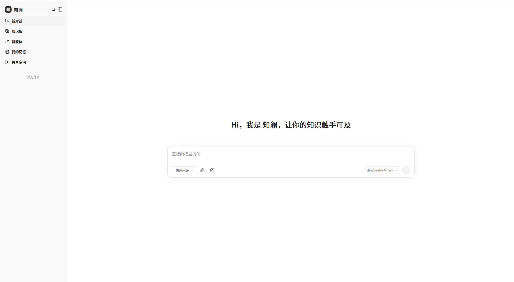
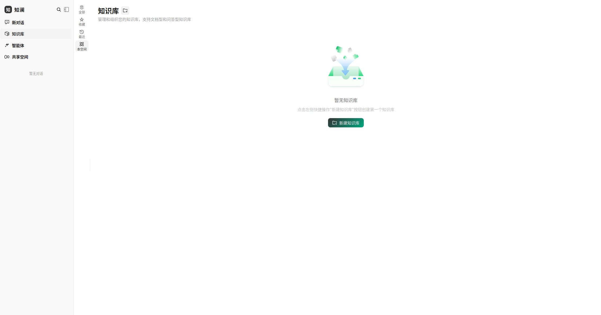
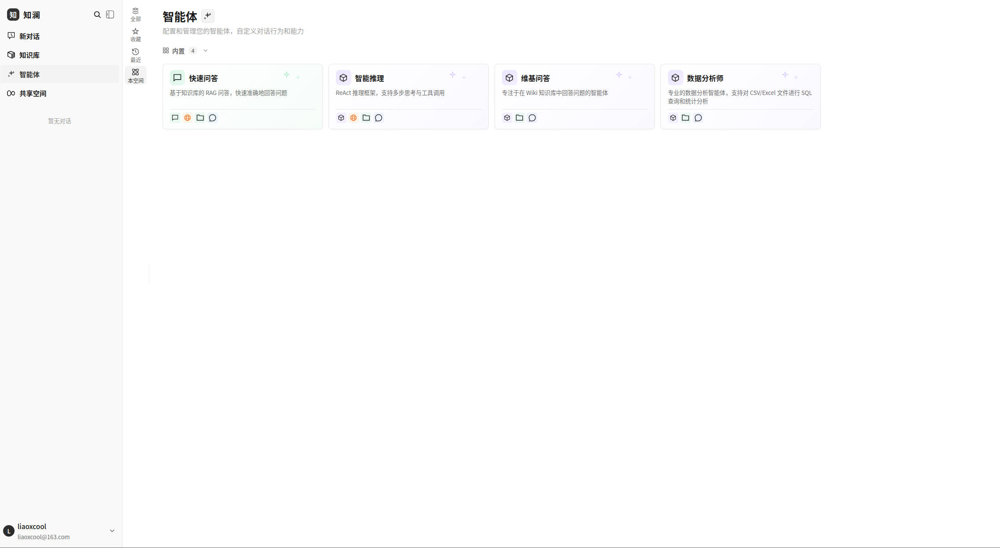
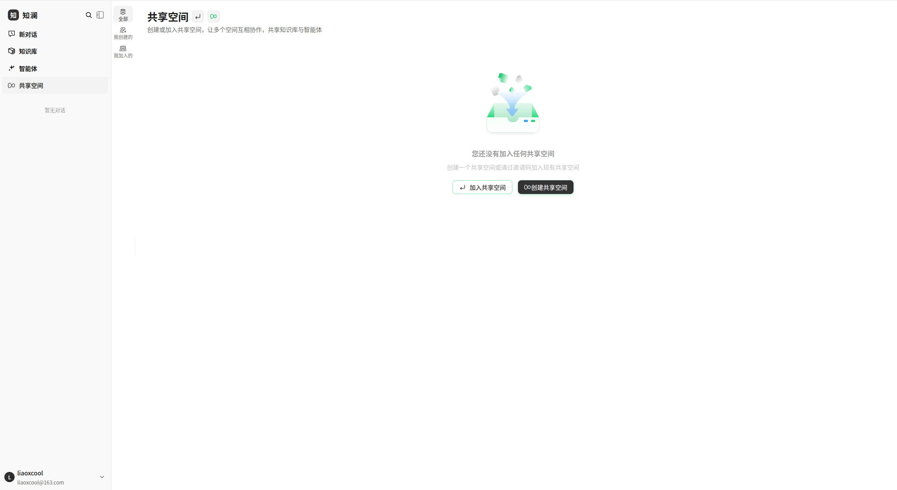
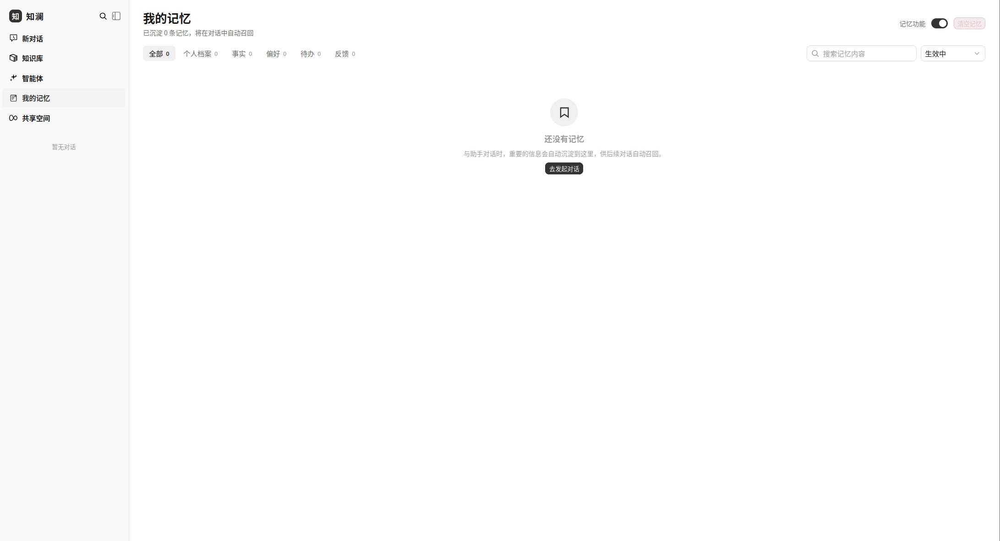
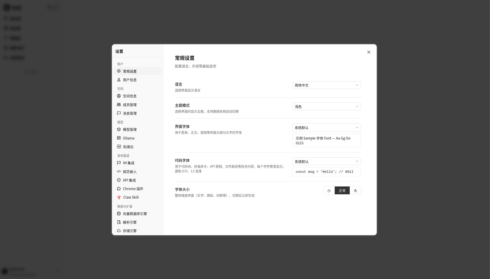

<div align="center">

<picture>
  <source media="(prefers-color-scheme: dark)" srcset="./images/logo-lockup-dark.svg?v=2">
  
</picture>

**知识汇聚成澜，让每一份文档活起来**

极简美学 × 深度解析 × 智能推理 —— 智能知识中枢

</div>

<p align="center">
    <a href="./LICENSE">
        
    </a>
    <a href="./CHANGELOG.md">
        
    </a>
    <a>
        
    </a>
    <a>
        
    </a>
</p>

<p align="center">
| <a href="./README.md"><b>English</b></a> | <b>简体中文</b> |
</p>

<p align="center">
  <h4 align="center">

  [项目介绍](#-项目介绍) • [特色功能](#-特色功能) • [架构设计](#-架构设计) • [功能概览](#-功能概览) • [快速开始](#-快速开始) • [文档](#-文档) • [开发指南](#-开发指南)

  </h4>
</p>

# 💡 知澜 Zilan — 知识汇聚成澜：RAG、Agent 推理与自动 Wiki 一体的极简知识中枢

## 📌 项目介绍

**知澜（Zilan）** 是一款基于大语言模型（LLM）的知识管理与智能问答平台，以极简的产品体验为目标，将 **RAG 快速问答**、**ReAct Agent 智能推理** 与 **自动 Wiki 知识沉淀** 融于一体。

知澜在成熟的开源知识框架工程底座上进行了全面重塑与深度定制，形成了独属自己的产品基因：

- **🎨 全新极简设计语言** — 摒弃传统企业软件的臃肿与花哨：深色单色品牌色（#333 系）、大圆角、轻阴影、纯色背景，从登录页、对话流到设置中心全链路视觉一致，安静克制，让内容成为主角
- **📄 深度文档解析管线** — PDF 表格结构化抽取、数学公式识别、双栏排版感知；按文档特征**自动路由**解析引擎强度，质量评分不过关自动换用更重引擎重试，疑难文档进入人工复核队列
- **🕸️ GraphRAG 图谱增强检索** — 基于 Neo4j 的实体关系存储，**社区摘要 + 局部子图检索**与稠密/稀疏向量检索互补，提升复杂多跳问题的召回广度与可解释性
- **🧠 记忆与知识沉淀体系** — 采用三层记忆架构：L1 工作记忆（当前对话上下文）、L2 短期记忆（近期对话摘要向量化）、L3 长期记忆（用户画像 + 事实三元组 + 待办事项）；会话结束后异步抽取记忆，按 `语义相似度 × 时间衰减 × 访问频次` 评分注入系统提示；长期记忆进一步结构化为**四模块体系——灵魂 / 用户档案 / 记忆流 / 经验技巧**（人设指令、用户画像、记忆流、沉淀技巧），「我的记忆」页面为每个模块提供独立视图，支持查看、编辑、删除 AI 记住的每一项内容，符合 GDPR 合规要求
- **🔐 自主可控的身份与协议** — 全栈独立的品牌标识、JWT 鉴权规范（`aud=zilan`）、Webhook 签名协议（`X-Zilan-Signature`）与网站嵌入 SDK（`zilan-widget.js`），不留任何上游痕迹

同时，知澜继承了经过大规模生产验证的工程能力：多源数据接入（飞书 / Notion / 语雀 / RSS，更多持续接入中）、二十余家主流模型厂商集成、十余种 IM 渠道直连问答、网站嵌入 Widget、四级 RBAC 权限矩阵与空间审计日志、AES-256-GCM 凭据静态加密、Langfuse 全链路可观测性与任务队列治理面板，以及完全私有化部署的模块化架构——大模型、向量数据库、存储后端均可灵活替换，数据完全自主可控。

## ✨ 特色功能

### 🎨 极简设计语言 · 为沉浸而生的界面

| 设计原则 | 落地细节 |
|------|------|
| 深色单色品牌 | 品牌色采用 #333 系深色单色，交互态仅做明度微调，杜绝花哨渐变与高饱和撞色 |
| 大圆角 × 轻阴影 | 全局圆角体系（8/10/12px 起步），卡片与气泡采用轻阴影甚至无阴影，视觉干净利落 |
| 纯色背景 | 页面背景回归纯色（浅色 #fafafa / 深色 #181818），无纹理、无底纹、无装饰性动画 |
| 居中式登录 | 品牌标识 + 表单的单一纵向焦点，删除一切与登录无关的信息噪音 |
| 对称气泡对话流 | 用户侧深色、助手侧浅灰的对称圆角气泡，引用与思考链路内联呈现 |
| 响应式适配 | 桌面 / 平板 / 移动端一致体验，深色模式全程跟随系统 |

### 📄 深度文档解析管线 · 把每一种 PDF 都读透

| 能力 | 详情 |
|------|------|
| 表格结构化抽取 | 识别表格边界并还原为 Markdown 表格，保留行列语义 |
| 公式识别 | 抽取数学公式并转换为 LaTeX，保障学术与技术文档的检索粒度 |
| 双栏排版感知 | 自动识别双栏 / 多栏排版并还原正确阅读顺序 |
| 自动路由 | 按文件大小、内容特征自动选择轻量或重度解析引擎，兼顾吞吐与质量 |
| 质量评估与重试 | 解析结果自动打分；内容过短或评分不达标时换用更重引擎重试 |
| 人工复核队列 | 重试耗尽的疑难文档进入复核队列，人工介入闭环处理 |

### 🕸️ GraphRAG 图谱增强检索

文档入库时自动抽取实体与关系存入 Neo4j，构建知识图谱；检索阶段以**社区摘要**提供全局视野、以**局部子图检索**提供邻域细节，与 BM25 / 稠密向量多路召回经 RRF 融合，显著提升多跳推理与跨文档汇总类问题的回答质量。

### 🧠 记忆与知识沉淀体系

为打造更懂你的个人知识助理体验，知澜正在构建三层记忆架构：

- **L1 工作记忆** — 当前对话的完整上下文与中间状态
- **L2 短期记忆** — 近期 N 轮对话摘要向量化存储（pgvector），会话初始化时按相关性召回
- **L3 长期记忆** — 用户画像、事实三元组（主体-关系-客体）、待办事项，结构化表 + 向量索引 + 可选图片库

配套机制：会话结束后经 Asynq 任务队列**异步抽取**记忆（事实三元组 / 待办任务 / 情感反馈）；记忆注入采用评分公式 `score = 语义相似度 × 时间衰减 × (1 + log(访问次数))` 取 Top-K 注入系统提示；高价值对话（用户收藏或多轮追问）自动沉淀为 Wiki 知识页并与源会话互链。

全新**「我的记忆」管理页面**让长期记忆完全透明可控：

- **浏览与筛选** — 分类页签（画像 / 事实 / 偏好 / 待办 / 反馈）带分类计数、关键词搜索、状态筛选（生效中 / 已完成 / 已归档）与分页；卡片展示重要度、置信度、召回次数与最近召回时间
- **编辑** — 修改内容、关联对象、重要性与状态；内容变更后自动重建语义向量，召回始终跟随最新表述
- **删除与清空** — 单条删除带二次确认；清空全部需输入确认文字解锁，同时清除会话滚动摘要，满足 GDPR 遗忘权
- **全局开关** — 一键暂停记忆抽取与召回；已保存记忆原样保留，可随时重新开启

所有操作按用户维度完全隔离，界面支持中文 / English / Русский / 한국어 四种语言，满足 GDPR / 个人信息保护合规。

#### 🗂️ 四模块结构化记忆（灵魂 / 用户档案 / 记忆流 / 经验技巧）

长期记忆不再是一锅平铺的事实列表，而是组织为四个语义清晰的模块——让助手不仅记住**事实**，还知道**自己该是谁**、**你是谁**、以及**怎么和你高效协作**：

| 模块 | 记什么 | 你看到的 |
|------|------|------|
| **灵魂** | 只读全局人设 + 你的风格指令（"叫我张工"、"回答要点式"） | 人设卡 + 指令列表；指令从对话中自动沉淀，注入每一次回答 |
| **用户档案** | 关于你的稳定属性（身份 / 职责 / 偏好） | 档案卡：分组呈现 + 完整度进度条，可下钻到记忆流 |
| **记忆流** | 全部记忆一览：事实、待办、反馈，以及 L2 会话摘要 | 原有分类筛选列表（同上） |
| **经验技巧** | 沉淀的技巧——从你的反馈中学到的可复用方法论 | 技巧卡 + 反馈墙，标注每条反馈是否已升级为技巧 |

工作机制：

- **抽取** — 在既有类别之外新增 `soul`、`skill` 两类记忆；技巧仅在用户显式评价 / 指令（置信度 ≥ 0.7）时产出，避免助手自造"技巧"
- **反馈 → 技巧升级** — 当你批评某个回答（"太啰嗦"），原始反馈会存档，**同时**被提炼为可执行的技巧（"回答保持要点式，避免长段落"）；反馈墙将两者关联展示
- **分模块注入** — 召回的记忆按固定顺序渲染为四个带标题的记忆块（风格指令 → 用户档案 → 相关记忆 → 助手经验），各模块独立预算：灵魂指令全量注入、档案取重要度前 4 条、技巧按重要度 × 置信度取前 3 条；灵魂指令还享有 ×1.5 语义权重加成，确保人设级指令不被话题匹配挤出局

零表结构变更：四模块是既有 `memory_facts` 表之上的代码层映射，编辑 / 删除 / 清空 / 全局开关等全部既有记忆管理能力原样适用。

### 🧠 上下文管理优化 · 对标 IMA 级五层智能架构

知澜对对话上下文的组织方式进行彻底重构，告别简单的滑动窗口，引入**精确 Token 预算 + 五层上下文架构**，让每一次回答都"把预算花在刀刃上"：

- **多厂商精确 Token 计数** — 内置 `tiktoken`（OpenAI）、`qwen`（通义千问）、`glm`（智谱 GLM）分词器与校准因子，拒绝字符数估算，按厂商特性精确计量
- **五层上下文预算（L0-L4）** — 系统层（固定）→ 记忆层（固定 10%）→ 检索层（弹性 30-50%）→ 历史层（弹性 20-40%）→ 查询层（固定），各层超限按不同溢出策略处理
- **意图动态分配** — 根据 query 意图实时调剂预算：代码/技术问题侧重检索层，闲聊/创意侧重历史层，摘要/分析则均衡分配
- **智能历史压缩** — 恢复增强 `Summary` 能力：Map-Reduce 增量摘要、Sticky 关键对话（决策/数字/Deadline/点赞）永久保留、长实体名自动别名压缩（如"腾讯云向量数据库"→"TVDB"）
- **检索上下文优化** — 相关性分层渲染（高相关全文 / 中相关前一半 / 低相关仅标题摘要）、基于 Embedding 余弦相似度的语义去重、完整章节路径引用溯源
- **Agent 上下文治理** — 超限工具结果先做 Inner Summary 再注入、ReAct Scratchpad 周期检查点压缩、结构化 JSON 工具输出规整，Long-context 场景更省 token、更准推理

可在 `config/config.yaml` 中全局开启，也支持按工作区定制：

```yaml
conversation:
  context_manager:
    max_tokens: 0                  # 0 = 根据当前模型自动解析上下文上限
    compression_strategy: "smart"  # "sliding_window"(默认) 或 "smart"(五层智能架构)
    recent_message_count: 0        # 0 = 使用系统默认轮数
    summarize_threshold: 0         # 0 = 3 倍 recent 窗口（智能摘要深取窗口）
```

### 🔐 自主品牌 · 协议独立

产品名、界面标识、浏览器标题、存储键、JWT audience、Webhook 签名头、嵌入 SDK 全栈统一为知澜 / Zilan 命名空间，构成完全自主的产品身份。

## 📱 功能展示

<table>
  <tr>
    <td colspan="2" align="center"><b>💬 智能问答对话</b><br/></td>
  </tr>
  <tr>
    <td width="50%" align="center"><b>📖 Wiki 浏览器</b><br/></td>
    <td width="50%" align="center"><b>🕸️ Wiki 知识图谱</b><br/></td>
  </tr>
  <tr>
    <td width="50%" align="center"><b>🤖 Agent 模式 · 工具调用过程</b><br/></td>
    <td width="50%" align="center"><b>⚙️ 对话设置</b><br/></td>
  </tr>
  <tr>
    <td colspan="2" align="center"><b>🔭 监控可观测性 · Langfuse Tracing</b><br/></td>
  </tr>
</table>

### 🖥️ 真实产品页面截图

<table>
  <tr>
    <td width="50%" align="center"><b>💬 新对话</b><br/></td>
    <td width="50%" align="center"><b>📚 知识库</b><br/></td>
  </tr>
  <tr>
    <td width="50%" align="center"><b>🤖 智能体</b><br/></td>
    <td width="50%" align="center"><b>👥 共享空间</b><br/></td>
  </tr>
  <tr>
    <td width="50%" align="center"><b>🧠 我的记忆</b><br/></td>
    <td width="50%" align="center"><b>⚙️ 系统设置</b><br/></td>
  </tr>
</table>

## 🏗️ 架构设计


从文档解析、向量化、检索到大模型推理，全流程模块化解耦，组件可灵活替换与扩展。支持本地 / 私有云部署，数据完全自主可控，零门槛 Web UI 快速上手。

## 🧩 功能概览

**智能对话**

| 能力 | 详情 |
|------|------|
| 智能推理 | ReACT 渐进式多步推理，自主编排知识检索、MCP 工具与网络搜索 |
| 快速问答 | 基于知识库的 RAG 问答，快速准确地回答问题 |
| Wiki 模式 | Agent 驱动从原始文档中自动生成并维护结构化、相互链接的 Markdown Wiki 知识页面 |
| 工具调用 | 内置工具、MCP 工具（含 OAuth2 远程服务、会话内 OAuth 授权）、网络搜索；支持 `@Skill / @MCP` 提及以按轮次范围化 Agent 运行时 |
| 对话策略 | 在线 Prompt 编辑、检索阈值调节、多轮上下文感知、按 Agent 引用输出开关 |
| 推荐问题 | 基于知识库内容自动生成推荐问题与答后追问 |
| 临时附件 | 会话级临时上传图片 / 文档，异步解析后用于一次性问答，支持图片与附件合并限额 |
| 引用与 RAG 进度 | 对话内引用浮层与引用抽屉（区分网络 / 知识库来源）、统一 Markdown 渲染、RAG 流水线分阶段进度展示 |
| 会话管理 | 侧边栏按来源（Web / IM / 嵌入）筛选与分组会话，支持会话标题内联重命名 |
| 记忆与个性化 | 三层记忆架构（见[特色功能](#-记忆与知识沉淀体系)）：异步事实抽取、评分召回注入，以及按四模块（灵魂 / 用户档案 / 记忆流 / 经验技巧）组织的「我的记忆」管理页面，支持浏览 / 编辑 / 删除记忆与全局记忆开关 |

**知识管理**

| 能力 | 详情 |
|------|------|
| 知识库类型 | FAQ / 文档 / Wiki，支持文件夹导入、URL 导入、多标签管理、在线录入 |
| 深度解析管线 | PDF 表格结构化抽取 / 公式识别 / 双栏感知 / 自动路由 / 质量评估重试 / 人工复核队列 |
| 按批次解析配置 | 上传确认对话框或 `process_config` API 覆盖解析引擎、分块、多模态（VLM / ASR）、图谱抽取与问题生成；支持 reparse 时调整配置 |
| 批量重新解析 | 一次为多篇文档重新排队解析，可携带批次级 `process_config` |
| 数据源导入 | 飞书 / Notion / 语雀 / RSS 订阅自动同步（更多数据源开发中），支持增量与全量同步 |
| 文档格式 | PDF / Word / Txt / Markdown / HTML / EPUB / MHTML / 图片 / CSV / Excel / PPT / JSON |
| 检索策略 | BM25 稀疏召回 / Dense 稠密召回 / GraphRAG 图谱增强（社区摘要 + 局部子图）/ 父子分块 / pgvector HNSW 加速（1024 维）/ 多维度索引 |
| 批量选择 | 知识库文档列表支持框选（marquee）多选，便于批量操作 |
| 端到端测试 | 检索+生成全链路可视化，评估召回命中率、BLEU / ROUGE 等指标 |

**集成与扩展**

| 能力 | 详情 |
|------|------|
| 模型厂商 | OpenAI / Azure OpenAI / Anthropic（Claude）/ DeepSeek / Qwen（阿里云）/ 智谱 / 混元 / 豆包（火山引擎）/ Gemini / MiniMax / NVIDIA / Novita AI / SiliconFlow / OpenRouter / Requesty / Ollama |
| 向量数据库 | PostgreSQL (pgvector) / Elasticsearch / OpenSearch / Milvus / Weaviate / Qdrant / Apache Doris / 腾讯云 VectorDB |
| Embedding | Ollama / BGE / GTE / 智谱 / OpenAI 兼容接口 |
| 对象存储 | 本地 / 腾讯云 COS / 火山引擎 TOS / MinIO / AWS S3 / 阿里云 OSS / 金山云 KS3 / 华为云 OBS；支持**每空间多实例存储后端**，不同知识库可绑定不同实例并设置默认实例 |
| IM 集成 | 企业微信 / 飞书 / Lark（飞书国际版）/ QQBot / Slack / Telegram / 钉钉 / Mattermost / 微信 / 云之家 |
| 网站嵌入 | 通过 `zilan-widget.js` 发布智能体到任意网站，支持域名白名单、限流与安全模式 Token 交换 |
| 网络搜索 | DuckDuckGo / Bing / Google / Tavily / Baidu / Ollama / SearXNG / Keenable / 智谱 AI |
| API 集成 | 权限范围 API Key（能力级授权 + 按 KB 限制 + 节流的 last_used 追踪）与 API 集成调试台；MCP OAuth 与嵌入会话按 Principal 隔离 |

**平台能力**

| 能力 | 详情 |
|------|------|
| 部署 | 本地 / Docker / Kubernetes (Helm)，支持私有化离线部署 |
| 界面 | Web UI / RESTful API / 网站嵌入 Widget；知澜极简设计语言全链路覆盖 |
| 权限控制 | 空间 RBAC 四级角色矩阵（Owner / Admin / Contributor / Viewer），按知识库的资源归属，每空间审计日志，invite-only 准入，无工作区预置与受控自助创建工作区，管理员密码重置（会话吊销），跨空间超级管理员，权限范围 API Key |
| 安全 | API Key 与 MCP / 数据源凭据 AES-256-GCM 静态加密、支持平滑密钥轮换；app ↔ docreader gRPC TLS + Token；Redis TLS；防 SSRF HTTP 客户端（覆盖数据源、URL 导入、重定向链等）；密钥响应脱敏；Agent 技能沙箱隔离 |
| 可观测性 | 集成 Langfuse（唯一追踪后端）以追踪 ReAct 循环、Token 消耗、工具调用和任务流水线；内置 Langfuse 风格的文档解析追踪时间线，逐阶段展示解析进度；系统管理员运行时任务队列面板（队列深度、按模型并发、失败任务排查与手动重试） |
| 任务管理 | MQ 异步任务，分阶段独立 Worker 池治理（core / 后处理 / enrichment / maintenance + 弹性共享池，Wiki 独立池）与按模型后台并发治理；版本升级自动数据库迁移 |
| 模型管理 | 集中配置，YAML 声明式内置模型配置，知识库级别模型选择，按模型思考模式与 Embedding 维度覆盖，交互式模型调试器，多空间共享内置模型，知澜云托管模型与文档解析 |

## 🚀 快速开始

### 🛠 环境要求

- [Docker](https://www.docker.com/) & [Docker Compose](https://docs.docker.com/compose/)
- [Git](https://git-scm.com/)

### 📦 安装与启动

```bash
git clone <你的代码仓库地址> zilan
cd zilan
cp .env.example .env   # 按需编辑 .env，详见文件内注释
docker compose up -d   # 启动核心服务
```

启动成功后访问 **http://localhost** 即可使用。

> 如需使用本地 Ollama 模型，请先运行 `ollama serve > /dev/null 2>&1 &`

### ⚙️ 初次运行配置（.env）

`.env.example` 按用途分区并附逐项注释（A 运行时基础 / B 数据与存储 / C 向量检索 / D 模型 / E 文档解析 / F 认证与安全），绝大多数项留空即用默认值。初次部署只需关注：

| 配置节 | 何时需要 | 说明 |
|--------|----------|------|
| `B1. 数据库` | 自建数据库时 | `docker compose up -d` 自带 PostgreSQL，默认连接参数开箱即用；自建库需改 `DB_DRIVER` / `DB_HOST` / `DB_PORT` / `DB_USER` / `DB_PASSWORD` |
| `F1. SYSTEM_AES_KEY` | 生产必改 | 32 字节静态加密密钥（加密 API Key / MCP / 数据源凭据）。默认值仅供体验；**丢失后已加密数据不可恢复，请妥善保管** |
| `D1 / D2. 模型` | 使用前需配置 | 启动后可在 Web UI「模型管理」配置任意厂商 API Key，或通过 `config/builtin_models.yaml` 声明式内置（详见文件内注释） |
| `F2.5. 验证码` | 可选 | 注册/登录的验证码与人机验证通道，见下文 |

**注册 / 登录验证码通道（可选，默认 log 开发模式）**

注册与登录支持手机号 / 邮箱双通道、格式自动校验、人机验证（滑块拼图或数字图形，`WEKNORA_AUTH_CAPTCHA_TYPE` 切换），密码须同时包含大小写字母与数字。验证码通道未配置时走 `log` 模式——验证码只写入服务端日志（搜 `auth/email:log` / `auth/sms:log`），不真正发送，便于零配置体验完整流程。

邮箱验证码真实发信（以 QQ 邮箱为例）：

```bash
WEKNORA_AUTH_EMAIL_PROVIDER=smtp            # log=只写日志（默认） / smtp=真实发信
WEKNORA_AUTH_EMAIL_SMTP_PRESET=qq           # 服务商预设，自动填充服务器地址/端口/加密方式
WEKNORA_AUTH_EMAIL_SMTP_USERNAME=you@qq.com # 发件邮箱
WEKNORA_AUTH_EMAIL_SMTP_PASSWORD=<SMTP授权码> # 非邮箱登录密码
```

- **预设支持**：`qq` / `163` / `126` / `gmail` / `exmail`（腾讯企业邮）/ `aliyun`（阿里企业邮）/ `outlook`（Microsoft 365）；自建企业邮箱不设 preset，直接填 `WEKNORA_AUTH_EMAIL_SMTP_HOST` / `PORT`（内网免认证中继可不填账号密码）
- **授权码获取**：QQ/163 邮箱在设置中开启 POP3/SMTP 服务后生成；Gmail 需开启两步验证后生成应用专用密码
- **短信验证码**：`WEKNORA_AUTH_SMS_PROVIDER=aliyun` 并补全四项阿里云短信凭证（`WEKNORA_AUTH_SMS_ALIYUN_*`）后真实发送

修改 `.env` 后重启生效：`docker compose down && docker compose up -d`

### 🔧 可选服务（Docker Compose Profile）

按需添加 `--profile` 启动额外组件，多个 profile 可叠加使用：

| Profile | 说明 | 启动命令 |
|---------|------|----------|
| _(默认)_ | 核心服务 | `docker compose up -d` |
| `full` | 全部功能 | `docker compose --profile full up -d` |
| `neo4j` | 知识图谱 (Neo4j) | `docker compose --profile neo4j up -d` |
| `minio` | 对象存储 (MinIO) | `docker compose --profile minio up -d` |
| `langfuse` | 链路追踪 (Langfuse) | `docker compose --profile langfuse up -d` |

组合示例：`docker compose --profile neo4j --profile minio up -d`

停止服务：`docker compose down`

### 🛠 本地二进制构建启动（不使用 Docker）

如果你希望直接在本机（Linux 等）编译并运行后端二进制，请按以下步骤操作。

**1. 安装依赖**（编译需 SQLite C 头文件，否则 CGO 编译会报 `sqlite3.h` 找不到）：

```bash
sudo apt-get update && sudo apt-get install -y libsqlite3-dev build-essential
```

**2. 编译后端二进制 `Zilan`**：

```bash
CGO_ENABLED=1 go build -o Zilan ./cmd/server
```

> 如需修改二进制产物名称，可调整 `Makefile` 中的 `BINARY_NAME`，或直接使用 `make build` 按该名称编译。

**3. 导出环境变量并启动**：

```bash
set -a && source .env && set +a && ./Zilan
```

**4. 启动开发基础设施**（PostgreSQL / Redis / Neo4j 等依赖服务，开发或本地调试时用）：

```bash
docker compose -f docker-compose.dev.yml --profile neo4j up -d
```

> 首次启动 dev 环境后若遇到 `WeKnora-*` 容器名冲突，可先 `docker rm -f WeKnora-neo4j-dev` 清理遗留容器。

### 🌐 服务地址

| 服务 | 地址 |
|------|------|
| Web UI | `http://localhost` |
| 后端 API | `http://localhost:8080` |
| 链路追踪 (Langfuse) | `http://localhost:3000` |

## 文档知识图谱

知澜支持将文档转化为知识图谱，展示文档中不同段落之间的关联关系。开启知识图谱功能后，系统会分析并构建文档内部的语义关联网络，不仅帮助用户理解文档内容，还为索引和检索提供结构化支撑，提升检索结果的相关性和广度。

具体配置请参考 [知识图谱配置说明](./docs/KnowledgeGraph.md) 进行相关配置。

## 配套 MCP 服务器

请参考 [MCP 配置说明](./mcp-server/MCP_CONFIG.md) 进行相关配置。

## 📘 文档

常见问题排查：[常见问题排查](./docs/QA.md)

详细接口说明请参考：[API 文档](./docs/api/README.md)

产品规划与计划：[路线图 (Roadmap)](./docs/ROADMAP.md)

## 🧭 开发指南

### ⚡ 快速开发模式（推荐）

如果你需要频繁修改代码，**不需要每次重新构建 Docker 镜像**！使用快速开发模式：

```bash
# 启动基础设施
make dev-start

# 启动后端（新终端）
make dev-app

# 启动前端（新终端）
make dev-frontend
```

**开发优势：**

- ✅ 前端修改自动热重载（无需重启）
- ✅ 后端修改快速重启（5-10 秒，支持 Air 热重载）
- ✅ 无需重新构建 Docker 镜像
- ✅ 支持 IDE 断点调试

**详细文档：** [开发环境快速入门](./docs/开发指南.md)

## 🤝 二次开发规范

知澜欢迎团队内部持续定制与演进。

**流程：** 新建分支 → 提交更改 → 合并至主干

**规范：** 使用 `gofmt` 格式化代码，遵循 [Conventional Commits](https://www.conventionalcommits.org/) 提交（`feat:` / `fix:` / `docs:` / `test:` / `refactor:`）

## 🔒 安全声明

在生产环境部署时，我们强烈建议：

- 将知澜服务部署在内网 / 私有网络环境中，而非公网环境
- 避免将服务直接暴露在公网上，以防止重要信息泄露风险
- 为部署环境配置适当的防火墙规则和访问控制
- 定期更新到最新版本以获取安全补丁和改进

##  许可证

本项目基于 [MIT](./LICENSE) 协议发布。
你可以自由使用、修改和分发本项目代码，但需保留原始版权声明。
